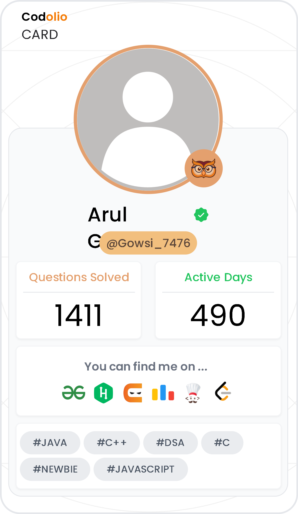

<!-- Banner -->

  

###  About Me
> Code whisperer, pixel prankster, and data detective on a mission to turn coffee into code and dreams into deployable reality! Whether it’s wrangling algorithms, spinning up full‑stack wonders, or hacking together side projects, every day starts with curiosity and ends with a commit that makes tech a tad more delightful.  
> Always ready to celebrate a bug fix with a victory dance, chasing deadlines with resilience, and turning “what ifs” into “why nots.”

### Contact

&nbsp;&nbsp;

---

## 🔧 Technical Skills

### 💻 Programming Languages

  
  
  
  
  

C | C++ | Java | Python | JavaScript

---

### 🧩 Frontend | Backend | DSA | Tools

<table>
<tr>
<td align="center" width="50%">

#### 🎨 Frontend

  
  
  

HTML | CSS | React

</td>
<td align="center" width="50%">

#### ⚙️ Backend & Database

  
  
  
  

Firebase | Cloudinary | MySQL | REST APIs

</td>
</tr>

<tr>
<td align="center" width="50%">

#### 📊 DSA & Competitive Programming

  
  

Data Structures | Competitive Programming

</td>
<td align="center" width="50%">

#### 🛠️ Tools & Platforms

  
  
  
  
  

Git | GitHub | VS Code | Eclipse | Maven

</td>
</tr>
</table>

## 📌 Projects

<table>
  <tr>
    <td width="50%" valign="top" align="center">
       
      <h3>Auction Bidding App</h3>
      <b>Tech:</b>  React,
       Firebase,
       Cloudinary  
      <b>Description:</b> Dynamic web app for live auctions. Seller dashboard and secure image uploads. 
      <b>Features:</b>
      <ul align="left">
        <li>🔒 Authenticated bidding</li>
        <li>⚡ Real-time updates</li>
        <li>🖼️ Image management</li>
      </ul>
      <b>Repo:</b> <a href="https://github.com/Gowsikakho/auction-bidding-app">View on GitHub</a>
    </td>
    <td width="50%" valign="top" align="center"> 
      <h3>TinDog Clone Website</h3>
      <b>Tech:</b>  HTML,
       CSS,
       Bootstrap  
      <b>Description:</b> Responsive Tinder-inspired site for dogs, sleek and mobile ready. 
      <b>Features:</b>
      <ul align="left">
        <li>📱 Mobile-friendly design</li>
        <li>💖 Fun UI animations</li>
        <li>👓 Clean layout</li>
      </ul>
      <b>Repo:</b> <a href="https://github.com/Gowsikakho/tindog-clone">View on GitHub</a>
    </td>
  </tr>
  <tr>
    <td width="50%" valign="top" align="center"> 
      <h3>Expense Tracker</h3>
      <b>Tech:</b>  React,
       Firebase  
      <b>Description:</b> Income & expenses tracker with real-time charts and dashboards. 
      <b>Features:</b>
      <ul align="left">
        <li>💰 Transaction management</li>
        <li>📊 Visual insights</li>
        <li>🔒 Auth & data security</li>
      </ul>
      <b>Repo:</b> <a href="https://github.com/Gowsikakho/expense-tracker">View on GitHub</a>
    </td>
    <td width="50%" valign="top" align="center"> 
      <h3>Todo Maven</h3>
      <b>Tech:</b>  Java,
       Maven  
      <b>Description:</b> CLI todo app for streamlined, prioritized task tracking. 
      <b>Features:</b>
      <ul align="left">
        <li>⚡ Fast CLI interface</li>
        <li>🔖 Priority support</li>
        <li>💾 Data persistence</li>
      </ul>
      <b>Repo:</b> <a href="https://github.com/Gowsikakho/todo-maven">View on GitHub</a>
    </td>
  </tr>
</table>

## 🏆 Certifications

  <!-- Example: Coursera -->
  
  &nbsp;&nbsp;
  <!-- Example: Udemy -->
  
  &nbsp;&nbsp;
  <!-- Example: Google -->
  

<!-- GitHub Stats (4 Cards) -->
<h2 align="center">📊 GitHub Stats</h2>

  <!-- General GitHub stats -->
  
  <!-- GitHub streak stats -->
  

  <!-- Most used languages -->
  
  <!-- Contribution heatmap -->
  

  <!-- Codolio Heatmap (use your uploaded image) -->
  

## 🌱 GitHub Contribution Graph

